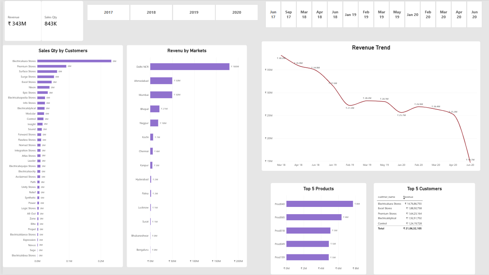
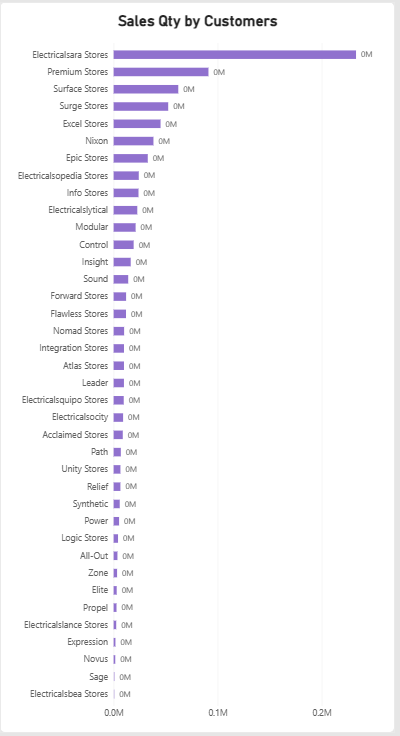
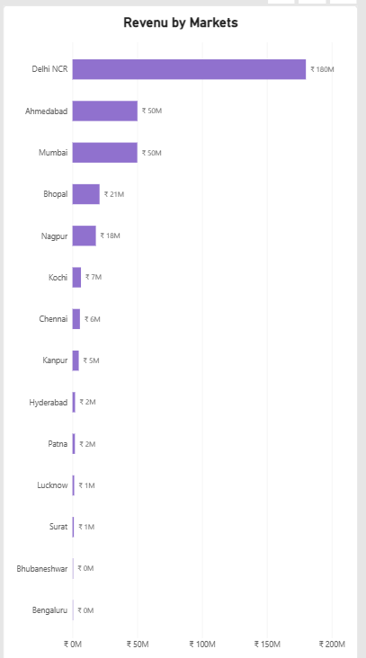

# Sales Insights – Power BI & SQL

## 📌 Project Overview

An end-to-end **Sales Analytics project** built using **SQL and Power BI** to analyze sales performance, revenue trends, market performance, and key business metrics.

The project demonstrates a complete data analytics workflow — from SQL-based data exploration and analysis to Power BI data modeling, DAX-based KPI development, and interactive dashboard creation.

---

## 🎯 Business Objective

The objective of this project is to transform raw sales transaction data into meaningful business insights that can help stakeholders:

* Monitor overall sales performance
* Identify high-performing and underperforming markets
* Analyze revenue trends over time
* Compare performance across markets
* Track key business KPIs
* Identify areas requiring business attention

---

## 🛠️ Tools & Technologies

* **SQL** – Data extraction, filtering, aggregation, joins, and analysis
* **Power BI** – Interactive dashboard development and visualization
* **Power Query** – Data cleaning and transformation
* **DAX** – Calculated measures and KPI development
* **Data Modeling** – Relationships between transaction and supporting tables

---

## 📊 Analysis Performed

### 1. Sales Performance Analysis

Analyzed sales transactions and overall business performance using key sales metrics and KPIs.

### 2. Market Analysis

Compared sales performance across different markets to identify high-performing and underperforming regions.

### 3. Revenue Trend Analysis

Analyzed revenue patterns over time to understand changes in sales performance and identify important trends.

### 4. Product & Customer Analysis

Examined product and customer performance to identify top-performing products and customers.

### 5. SQL Analysis

Used SQL queries to explore transaction data, apply filters, perform aggregations, and join relevant tables for business analysis.

### 6. Data Modeling

Built relationships between transaction and date-related tables in Power BI to support interactive analysis.

---

## 📈 Dashboard Preview

### Dashboard Overview



### Market Analysis



### Revenue Analysis



### Data Model


---

## 📁 Project Structure

```text
Sales-Insights-PowerBI/
│
├── README.md
├── Sales Insights Dashboard.pbix
├── sales_analysis.sql
│
└── screenshots/
    ├── Data Model_.png
    ├── Revenue-trend.png
    ├── Top 5 products & customers.png
    ├── dashboard-overview.png
    ├── market-analysis.png
    └── revenue_analysis.png
```

---

## 💡 Key Skills Demonstrated

* SQL
* Power BI
* DAX
* Power Query
* Data Cleaning
* Data Modeling
* KPI Development
* Data Visualization
* Business Analysis
* Insight Generation

---

## 🚀 Project Outcome

Developed an interactive **Power BI sales dashboard** that converts transaction-level data into actionable business insights, enabling users to monitor KPIs, evaluate market performance, analyze revenue trends, and identify top-performing products and customers.

---

## 👩‍💻 Author

**Suvarna Dudela**

B.Tech Civil Engineering | NIT Rourkela

Aspiring Data Analyst / Business Analyst

